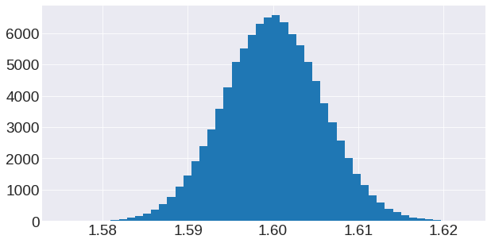
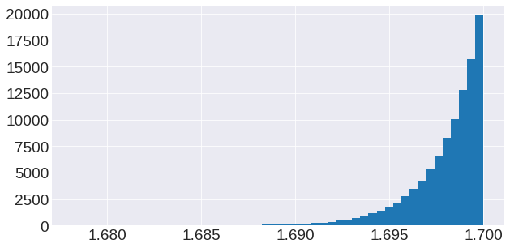

# Probability_theory

- Plot_distributions.ipynb: Densities and F-transforms of the arcsine, semicircle, and normal distribution. Example for the central limit theorem and an extreme value limit. 

 &nbsp;   &nbsp;  &nbsp;   &nbsp;  &nbsp;   &nbsp; &nbsp;  &nbsp;   &nbsp;  &nbsp; 

- Random_matrices.ipynb: Simulation of GUE random marices and an AR(1) process with GUE noise and squared GUE noise.

- Sample_paths.ipynb: Simulation of sample paths of a Brownian motion and Poisson processes.

   &nbsp;  &nbsp;   &nbsp; &nbsp;  &nbsp;   &nbsp;
